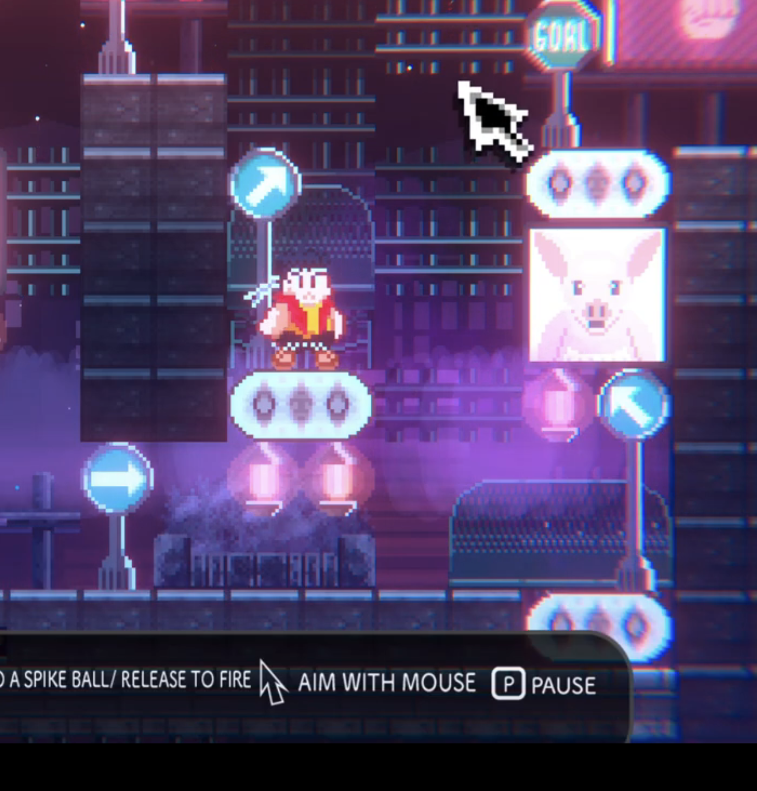

# Bug ID: 
Title: Mouse UI bug 

Enviroment: 
- Platform: Windows and macOS
- Resolution: 1920x1080 

Severity: Major 
Priority: High 
Frequency: Fairly Consistent 

Steps to reproduce: 

1. Launch the game. 
2. During the tutorial, after the dialogue, aim the mouse anywhere across the screen. 
3. Access whether the mouse UI appears or the system's mouse UI is displayed on the screen. 

Expected Result: 
- A medium-sized pixel-drawn mouse UI 

Actual Result: 
- The platform of use mouse UI appearing instead of the pixel-drawn mouse UI. 

Attachments: 

Result: 
- Difficulty trying to track where the mouse's location was on the screen during gameplay. 

